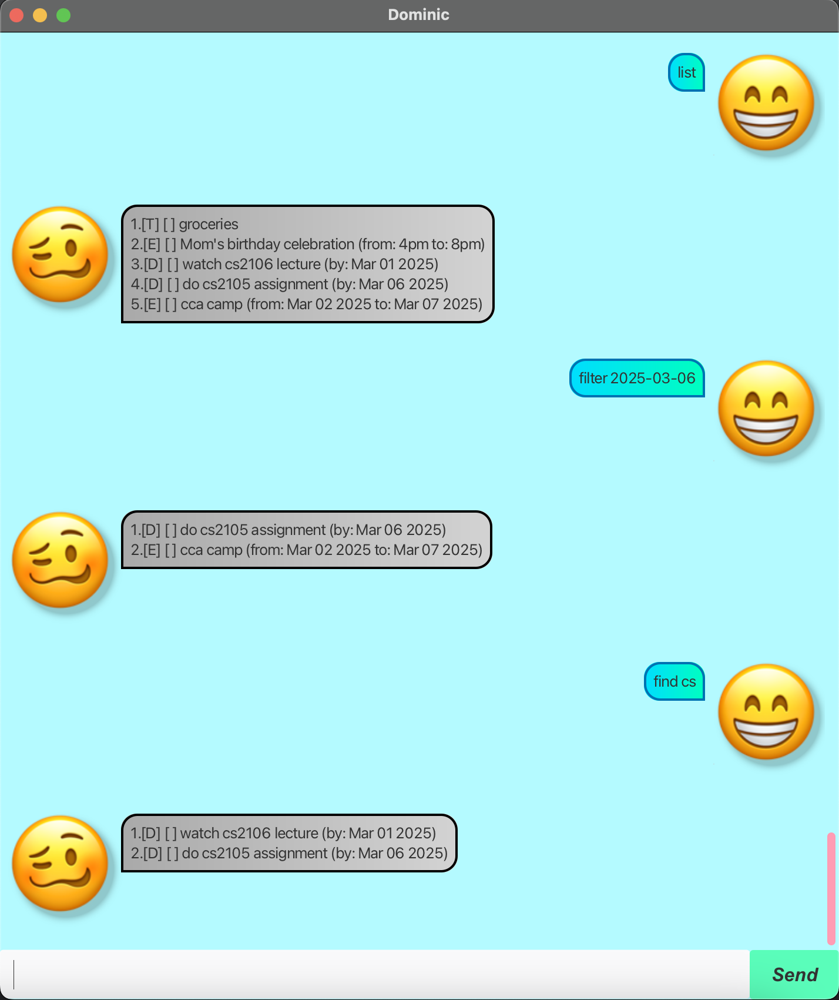

# Dominic User Guide



Dominic, your personal task management chatbot assistant

## Adding todos

Add anything that you will need to do

Example: `todo do laundry`
```
Noted, added new task:
    [T] [ ] do laundry
Now you have 1 task(s) pending.
```

## Adding Deadlines

Add anything you need to do that has a deadline

Example: `deadline watch lecture /by tmr`
```
Noted, added new task:
    [D] [ ] watch lecture (by: tmr)
Now you have 2 task(s) pending.
```

## Adding Events

Add an event which has a start and end date

Example: `event cca camp /from 2025-03-02 /to 2025-03-07`
```
Noted, added new task:
    [E] [ ] cca camp (from: Mar 02 2025 to: Mar 07 2025)
Now you have 3 task(s) pending.
```

## Marking Tasks

Marks a task as completed

Example: `mark 2`
```
Ok, bet, marked it:
    [D] [x] watch lecture (by: tmr)
```

## Unmarking Tasks

Unmark a task

Example: `unmark 2`
```
Ok, bet, marked it:
    [D] [ ] watch lecture (by: tmr)
```

## Listing Tasks

List all tasks

Example: `list`
```
1.[T] [ ] do laundry
2.[D] [ ] watch lecture (by: tmr)
3.[E] [x] cca camp (from: Mar 02 2025 to: Mar 07 2025)
```

## Deleting Tasks

Delete a task

Example: `delete 1`
```
Got it, deleted task:
    [T] [x] do laundry
Now you have 2 task(s) pending.
```

## Archiving Tasks

Archives a task/all tasks

Example 1: `archive 1`
```
Got it, archived task:
    [D] [ ] watch lecture (by: tmr)
Now you have 1 task(s) pending.
```

Example 2: `archive all`
```
All tasks have been archived.
```

## Find Tasks

Find tasks that contain a certain substring

Example: `find cs`
```
1.[T] [ ] do cs2106 assignment
2.[D] [x] watch cs2105 lecture
3.[T] [ ] take pics
```

## Filter Tasks

Filter tasks that fall on a certain date

Example: `filter 2025-03-02`
```
1.[D] [ ] watch cs2103t briefing (by: Mar 02 2025)
2.[E] [x] japan trip (from: Mar 01 2025 to: Apr 01 2025)
```

### Done using the chatbot?
Just use the command `bye`!!